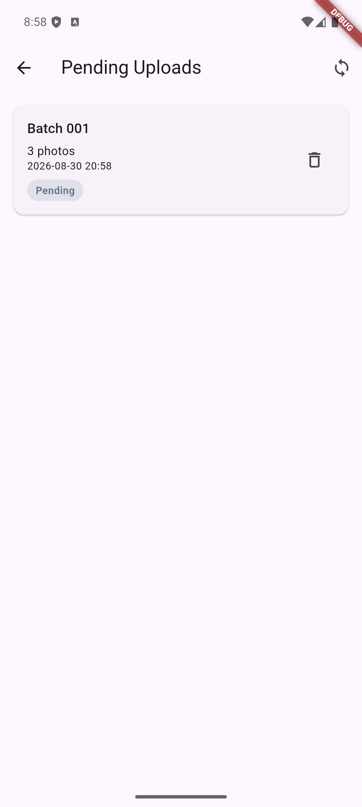

# Camera Sync — Advanced Camera & Sync Engine (Flutter)

Task 2 of the Senior App Developer Technical Assessment: a custom camera UI with
pinch/slider/button zoom and tap-to-focus, batch image capture into a persistent local
upload queue, and a resilient sync engine that survives offline periods, app kills, and
device reboots — including automatic background synchronization via WorkManager.

## Project Structure / Approach

Clean Architecture in four layers, with **`flutter_bloc` Cubit** as the sole state-management
mechanism:

```
presentation/   Cubit + State (Equatable) + View, one pair per feature
domain/         entities, repository interfaces, use cases, the sync engine itself
data/           repository implementations + concrete data sources (camera plugin, SharedPreferences, mock API)
services/       connectivity and background-sync abstractions + their platform implementations
core/           constants, typed errors, DI (get_it), small utilities
```

Dependency injection is `get_it` (`core/di/service_locator.dart`): use cases and
`CameraCubit` are **factories** (fresh instance per screen); `SyncEngine`, both
repositories, both data sources, `UploadCubit`, and `BackgroundSyncService` are **lazy
singletons** — there is exactly one upload queue and one sync engine for the whole app,
shared between the camera screen and the pending-uploads screen.

### Camera flow

```
CameraPreviewScreen
        ↓
CameraCubit
        ↓
CaptureImage (use case)
        ↓
CameraRepository (interface)
        ↓
CameraDataSource (interface) → FlutterCameraDataSource (only file that imports package:camera)
```

- **Lifecycle** — `CameraPreviewScreen` disposes the camera on `AppLifecycleState.inactive/
  paused` and reinitializes on `resumed`; `FlutterCameraDataSource` only swaps in a new
  `CameraController` *after* it has successfully initialized, disposing the previous one
  afterward, so there is never a window with zero or two open controllers.
- **Zoom** — pinch (`onScaleUpdate`), the `Slider`, and the quick-select buttons
  (`zoom_button_calculator.dart`) all call the same `CameraCubit.setZoomLevel()`, which
  clamps against the real device-reported `getMinZoomLevel()/getMaxZoomLevel()` before
  forwarding to the plugin — one field (`state.zoomLevel`), three inputs, always in sync.
- **Focus** — a tap on the preview is normalized to a `0..1` coordinate
  (`NormalizedFocusPoint`) and passed down to `setFocusPoint` + `setExposurePoint`; a visual
  indicator is placed at the raw tap `Offset` and auto-clears after 1.5s via a cancelable
  `Timer` (cancelled on a new tap and on dispose — no leak). Live-verified: the indicator
  renders exactly at the tapped screen position.
- **Batch capture** — each capture is copied from the plugin's temporary file into the app's
  persistent documents directory under a generated id; `clearCurrentBatch()` is only ever
  called *after* the batch has been successfully persisted to the queue, so a failed
  persistence attempt never silently drops captured images.

### Upload / sync flow

```
PendingUploadsScreen
        ↓
UploadCubit
        ↓
SyncPendingUploads (use case)
        ↓
SyncEngine
        ↓
UploadRepository (interface) → UploadRepositoryImpl
        ↓
UploadQueueDataSource (SharedPreferencesUploadQueueDataSource) + UploadDataSource (MockUploadDataSource)
```

**Every sync trigger in the app converges on this exact same `SyncEngine` instance — there is
only one implementation of the upload algorithm in the whole codebase.**

| Trigger | Path |
|---|---|
| App startup | `UploadCubit` constructor → `SyncPendingUploads()` |
| Connectivity restored | `UploadCubit`'s connectivity-stream listener → same call |
| Manual "Sync now" / per-batch retry | `UploadCubit.retry()` → same call |
| WorkManager (background) | `background_sync_callback_dispatcher.dart` → `SyncPendingUploads(freshSyncEngine)` → same call |

- **Persistent queue** — `SharedPreferencesUploadQueueDataSource` stores the whole queue as
  one JSON array under a single key. Each write (`_writeAll`) is a single atomic
  `SharedPreferences.setString` call, so a process kill mid-write lands either the old value
  or the new one, never a torn one. Any batch found stuck in `uploading` on the very first
  read after a (re)start is recovered back to `pending` — this is what stops a batch from
  becoming permanently invisible to `SyncEngine` after a kill mid-upload. Corrupted JSON is
  treated as an empty queue rather than crashing; a single malformed record inside an
  otherwise-valid array is skipped without losing the rest of the queue.
- **Connectivity** — `ConnectivityPlusService` doesn't trust "Wi-Fi connected" as proof of
  internet access: it layers a **DNS reachability probe**
  (`InternetAddress.lookup('example.com')`, 3s timeout) on top of `connectivity_plus`'s
  interface-level signal before ever reporting `online`. `.distinct()` on the stream stops
  repeated identical statuses (e.g. Wi-Fi flapping while still genuinely online) from
  re-triggering a sync.
- **Sequential uploads** — `SyncEngine._runSync()` processes syncable batches (`pending` +
  `failed`; `uploading` is left alone) one at a time in a plain `for` loop, never
  concurrently — asserted by a test that tracks max-concurrent-uploads.
- **Failed uploads stay queued** — a failure (including a missing local image file, or any
  unexpected exception) marks the batch `failed` and leaves it in the queue; it is never
  deleted or silently dropped.
- **File deletion only after confirmed success** — `_uploadOne()` removes a batch from the
  queue and deletes its local image files *only* after the mock API call has actually
  returned successfully, in that order — never before, never on failure.
- **Retry, without user intervention** — connectivity restoring is itself a trigger (see
  table above); no button press is required for a previously-failed batch to be retried once
  the network comes back.
- **Mocked API** — per the assignment's note that no real API would be provided,
  `MockUploadDataSource` is a deterministic, hardcodable success/failure stand-in
  (`shouldSucceed`, fixed non-random latency) — never a real HTTP call.

### Background sync (WorkManager)

```
WorkManager (Android system scheduler)
      ↓
callbackDispatcher() — background_sync_callback_dispatcher.dart
      ↓
SyncPendingUploads(freshSyncEngine)
      ↓
SyncEngine.sync()
      ↓
same persistent SharedPreferences-backed queue the foreground app reads/writes
```

The background isolate builds its **own minimal dependency chain** — a fresh
`SharedPreferencesUploadQueueDataSource()`, `MockUploadDataSource()`, and
`ConnectivityPlusService()` — and never touches `get_it`, `BuildContext`, widgets,
`CameraController`, `CameraCubit`, or `UploadCubit`; none of those exist in a background
isolate. It calls straight through `SyncPendingUploads → SyncEngine.sync()`, the same domain
entry point every other trigger uses — nothing about the sync algorithm is duplicated for the
background path.

`WorkManagerBackgroundSyncService.schedulePeriodicSync()` registers a periodic task with a
`NetworkType.connected` constraint and `ExistingPeriodicWorkPolicy.keep` (idempotent — this,
not caller-side deduplication, is what prevents duplicate periodic jobs across the app's 4
scheduling call sites: startup, batch added, connectivity restored, and a sync that completed
with failures). `sync_result_mapper.dart` maps `SyncResult` to the boolean WorkManager's
worker contract expects: `completed`/`nothingToSync`/`skippedOffline`/`alreadyInProgress` all
report success (no retry — avoids hammering the device for conditions already handled
safely); only `completedWithFailures` reports failure, deferring entirely to **WorkManager's
own** backoff policy — no second backoff algorithm exists anywhere in this codebase.

**This was verified live, not just unit-tested** — WorkManager cannot meaningfully run inside
`flutter test`'s VM, so the unit suite stops at the pure Dart boundary
(`sync_result_mapper_test.dart`). On a real Android emulator this session, `adb logcat`
captured the actual background execution: `WM-WorkerWrapper: Starting work for
dev.fluttercommunity.workmanager.BackgroundWorker` followed by a fresh Flutter engine
starting up in that isolate, and a batch queued while offline was confirmed gone after the
worker ran — proving both isolates really do share the same persisted queue. Also verified
live: the queue survives a full `adb reboot`, and a batch stays queued while offline and
auto-clears within seconds of reconnecting.

### Testing

74 tests (`flutter test`), `flutter analyze` clean. Notable coverage: `sync_engine_test.dart`
(sequential-not-concurrent, stale-`uploading` left alone, files deleted only after confirmed
success, missing-file handling), `upload_cubit_test.dart` (a dedicated test shares one
`SyncEngine` instance across retry + connectivity-restore + a simulated third trigger to
assert exactly one execution, not three — the same race class the concurrency section below
describes), `shared_preferences_upload_queue_data_source_test.dart` (stale-recovery, corrupted
JSON), `sync_result_mapper_test.dart` (the WorkManager result-mapping contract).

## Important Limitations — read before assuming more than what's built

### Zoom / lens switching

The quick zoom buttons operate within the **selected camera's actual supported zoom range**
(via `CameraController.getMinZoomLevel()/getMaxZoomLevel()`), filtered from a candidate list
(`0.5, 1, 2, 3, 5`). This is **not** physical multi-lens switching — the `camera` Flutter
plugin exposes one logical camera and its continuous digital/optical zoom range, not a way to
switch between a device's separate ultra-wide/wide/telephoto lenses the way a native camera
app's 0.5x/1x/2x buttons typically do. True physical lens switching would require additional
platform-specific integration (or a different plugin with that capability) beyond this
plugin's scope.

### Cross-isolate concurrency

`SyncEngine._isSyncing` is a plain in-memory boolean. It correctly and safely prevents two
concurrent `sync()` calls **within one Dart isolate** — verified by a test that fires three
simultaneous calls on the same instance and asserts exactly one real execution. It does
**not**, and cannot, act as a mutex **across isolates**: the WorkManager background isolate
constructs its own separate `SyncEngine` instance, sharing no memory with the foreground
app's singleton. The only realistic overlap window is the foreground app syncing at the exact
moment the background worker also fires — a narrow case, and Android's own WorkManager
guarantees at most one execution of a given *unique* periodic work at a time, so the
background side alone can't duplicate itself. This assessment's implementation deliberately
keeps the concurrency guard scoped to a single isolate rather than adding a second,
independent lock in the worker. A production implementation targeting a real (non-mock) API
without inherent idempotency would want a persisted cross-process lock or, better, an
idempotency key on the upload request itself.

### iOS

**Android was the verified target for this assessment.** The `workmanager` plugin's required
`Info.plist` entries (`UIBackgroundModes`, `BGTaskSchedulerPermittedIdentifiers`) are present,
but iOS background execution was **not built or tested on a simulator or device** in this
engagement. Even if it had been, BGTaskScheduler execution timing is opportunistic and
OS-throttled by design — it cannot be verified the deterministic way the Android evidence
above was.

## Generative AI Usage

Generative AI was used as a development assistant for architecture exploration,
implementation scaffolding, test generation, debugging, lifecycle analysis, and
documentation. Generated suggestions and code were reviewed, adapted, tested, and manually
verified — including live testing on an Android emulator, which is what produced the
WorkManager evidence described above and caught issues static analysis alone would not have
(a `GetIt.reset()` async race in test setup, an `async*`/broadcast-stream subscription-timing
race, a widget-lifecycle bug from reading a Cubit inside `dispose()`).

The prompts below are **representative** of the kind of direction given throughout the
engagement, not an exact transcript:

- "This is not what Task 2 is — the Flutter task is completely different, go read the
  assignment document again." (an early wrong attempt at Task 2 — built as an attendance-app
  duplicate before actually reading the spec — was caught and the project was wiped and
  restarted correctly)
- "Implement only the persistent local upload queue for now — capture, camera UI, and sync
  come later. Here's the exact test list I want covered, including corrupted-data recovery."
- "Now the sync engine. `UploadCubit`/connectivity/WorkManager/the retry button must all call
  through one central `SyncEngine.sync()` — never re-implement the upload algorithm in more
  than one place."
- "Implement WorkManager background sync. The existing `SyncEngine` concurrency guard must
  remain the final protection — do not create a second, unrelated lock in the worker. Explain
  the `SyncResult`→WorkManager-result mapping you choose, including why."
- "Verify this live on a real emulator, not just with unit tests — I want actual logcat proof
  the background isolate ran, not just 'the code should work.'"

## How to Run

**Requirements:** Flutter SDK (Dart `^3.12.2`), an Android device/emulator (this is the
verified target — see the iOS limitation above).

```bash
git clone https://github.com/t-t-tanzil/IM_mobile_taqi.git
cd IM_mobile_taqi/Flutter_cam_task
flutter pub get
flutter run
```

To run the tests and static analysis:

```bash
flutter analyze
flutter test
```

To build a release APK:

```bash
flutter build apk --release
```

(The release build currently signs with the debug keystore, matching the default Flutter
template — see `android/app/build.gradle.kts`. This is fine for an assessment submission; a
real release would need a dedicated, non-debug signing key.)

## Screenshots

| | |
|---|---|
|  Camera preview |  Tap-to-focus indicator |
|  Batch captured, ready to queue |  Pending uploads list |
|  A failed upload, queued for retry |  Empty queue after a successful retry |
|  Queue intact after a full device reboot | |

*All of the above are real captures from live device/emulator testing during this
engagement, not staged or fabricated. They are not an exhaustive set — e.g. the zoom controls
and the "Failed" per-batch retry icon mid-tap aren't separately captured yet; add more to
`screenshots/` and this table as needed before final submission.*
