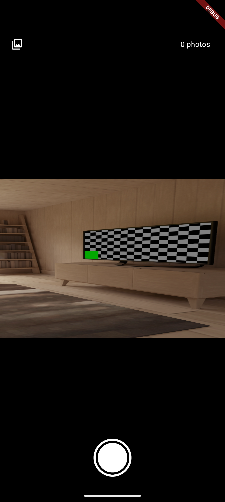
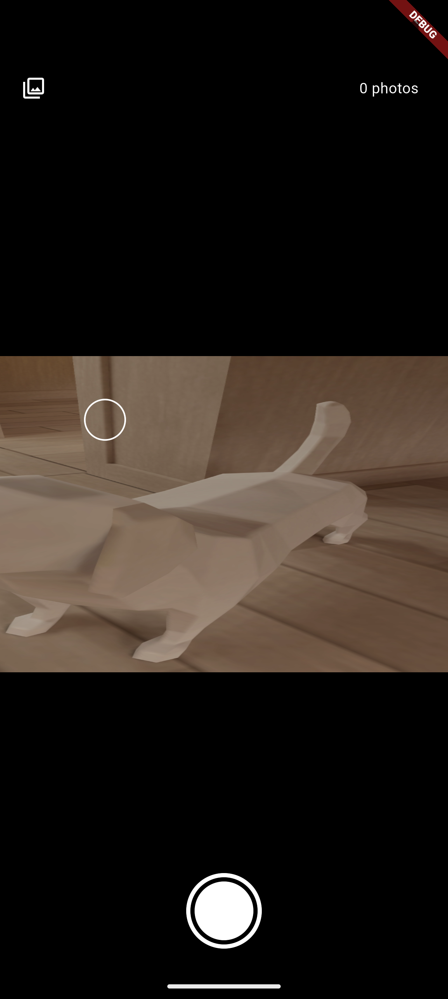
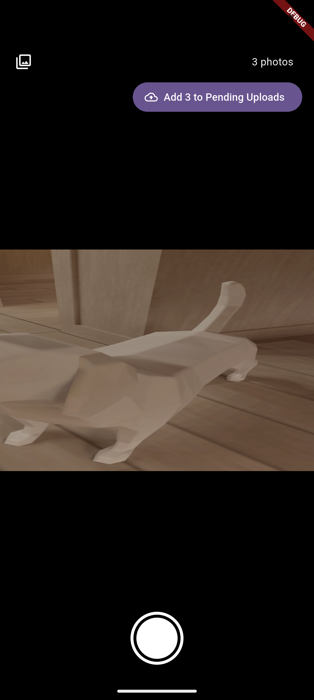
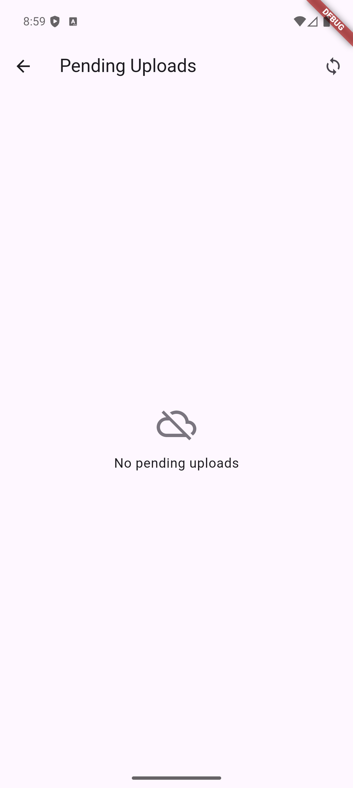
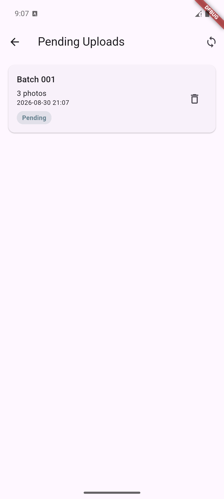
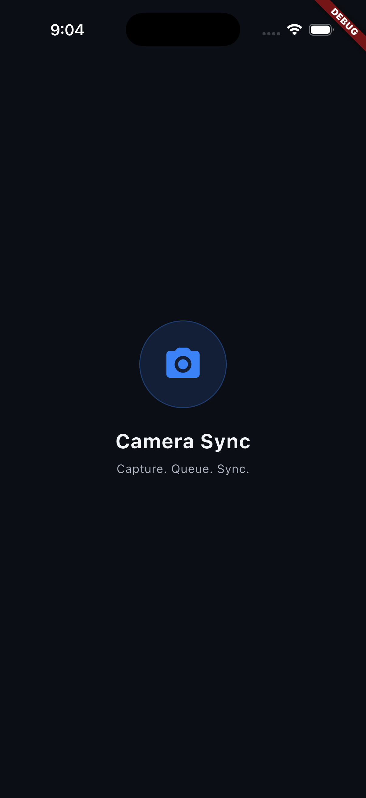
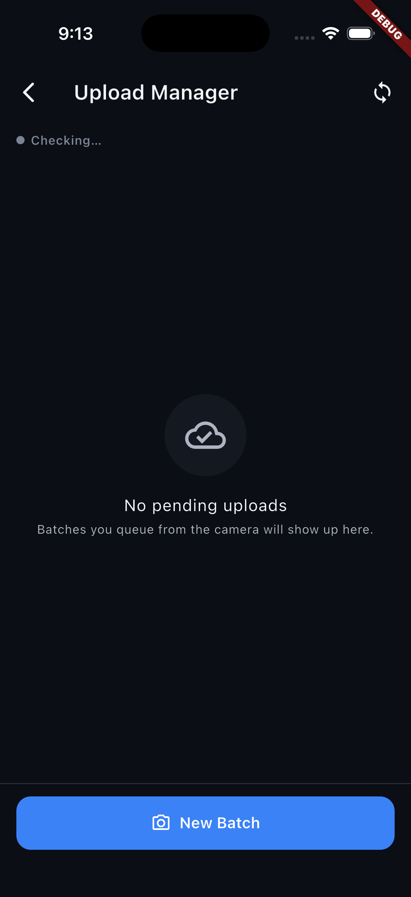

# Camera Sync — Camera Capture & Persistent Upload Queue (Flutter)

A Flutter application implementing a production-oriented camera capture and upload workflow.

The app provides a custom camera experience with pinch/slider/quick-select zoom, tap-to-focus,
front/back camera switching, batch photo capture, persistent local upload queues, automatic
retry, connectivity-aware synchronization, and Android background synchronization through
WorkManager.

The implementation follows **Clean Architecture**, uses **flutter_bloc** as the sole UI state
management mechanism, persists the upload queue through **SharedPreferences**, and keeps the
foreground and background synchronization paths converged on the same domain-level
`SyncEngine`.

---

## Features

- Custom camera preview with:
  - Pinch-to-zoom
  - Vertical slider zoom
  - Quick-select zoom buttons
  - Front/back camera switching
  - Tap-to-focus with visual focus indicator
- Batch photo capture.
- Persistent local upload queue.
- Upload Manager screen with:
  - Live connectivity status
  - Per-batch status
  - Real photo thumbnails
  - Manual retry
  - New Batch action
- Automatic synchronization when connectivity is restored.
- Sequential upload processing to prevent concurrent batch uploads.
- Recovery of interrupted `uploading` batches after process death or reboot.
- Android background synchronization through WorkManager.
- Persistent queue shared between foreground and background execution.
- Fixed 2-second splash screen.
- Double-back-press-to-exit on the root camera screen.

---

# Architecture

The application follows **Clean Architecture** with explicit separation between presentation,
domain, data, and platform/service concerns.

```text
┌──────────────────────────────────────────────────────────────┐
│                      PRESENTATION                            │
│                                                              │
│  CameraPreviewScreen       PendingUploadsScreen              │
│          │                         │                         │
│     CameraCubit              UploadCubit                     │
└──────────┼─────────────────────────┼─────────────────────────┘
           │                         │
           ▼                         ▼
┌──────────────────────────────────────────────────────────────┐
│                         DOMAIN                               │
│                                                              │
│  Use Cases          Repository Interfaces        SyncEngine   │
│                                                              │
│  CaptureImage       CameraRepository             sync()       │
│  SyncPendingUploads UploadRepository                          │
└──────────┼─────────────────────────┼─────────────────────────┘
           │                         │
           ▼                         ▼
┌──────────────────────────────────────────────────────────────┐
│                           DATA                               │
│                                                              │
│  Repository Implementations                                  │
│          │                                                   │
│          ├── CameraDataSource                                 │
│          ├── UploadQueueDataSource                            │
│          └── UploadDataSource                                │
└──────────┼─────────────────────────┼─────────────────────────┘
           │                         │
           ▼                         ▼
┌──────────────────────┐   ┌───────────────────────────────────┐
│ Platform / Plugins   │   │ Persistent Storage / Mock API      │
│                      │   │                                   │
│ camera               │   │ SharedPreferences                  │
│ connectivity_plus    │   │ MockUploadDataSource              │
│ WorkManager          │   │                                   │
└──────────────────────┘   └───────────────────────────────────┘
```

### Layer Responsibilities

```text
presentation/
    UI, Cubits, immutable state and user interaction

domain/
    Entities, repository contracts, use cases and SyncEngine
    No Flutter UI or platform implementation details

data/
    Repository implementations and concrete data sources

services/
    Connectivity and background synchronization abstractions
    plus their platform-specific implementations

core/
    Constants, typed errors, dependency injection and utilities
```

The dependency direction is intentionally one-way:

```text
Presentation
     │
     ▼
   Domain
     │
     ▼
    Data
```

The domain layer does not depend on Flutter widgets or concrete platform implementations.

---

# Dependency Injection

`get_it` is used as the application's dependency injection container.

The lifetime of each dependency is deliberate:

```text
Factories
├── CameraCubit
└── Camera-related use cases

Lazy Singletons
├── SyncEngine
├── UploadCubit dependencies
├── CameraRepository
├── UploadRepository
├── UploadQueueDataSource
├── UploadDataSource
└── BackgroundSyncService
```

The upload queue and `SyncEngine` therefore represent shared application-level infrastructure
rather than screen-specific state.

This is important because the camera screen and Upload Manager screen must operate on the
same persisted queue and synchronization mechanism.

---

# Camera Architecture

The camera implementation keeps the Flutter `camera` plugin behind a data-source boundary.

```text
CameraPreviewScreen
        │
        ▼
   CameraCubit
        │
        ▼
  CaptureImage
        │
        ▼
CameraRepository
        │
        ▼
CameraDataSource
        │
        ▼
FlutterCameraDataSource
        │
        ▼
CameraController
```

Only the concrete camera data source knows about the `camera` package.

This keeps the domain layer independent from the plugin and makes the camera-related logic
testable without requiring a real camera in unit tests.

---

# Zoom Architecture

All zoom controls modify the same logical zoom state:

```text
             ┌───────────────┐
             │ Pinch Gesture │
             └───────┬───────┘
                     │
             ┌───────▼───────┐
             │               │
Slider ─────►│ CameraCubit   │◄──── Quick-select buttons
             │               │
             └───────┬───────┘
                     │
                     ▼
             CameraState.zoomLevel
                     │
                     ▼
             CameraController
```

The quick-select values (`0.5x`, `1x`, `2x`, `3x`, `5x`) are filtered against the actual
`getMinZoomLevel()` / `getMaxZoomLevel()` range reported by the active camera.

### Important distinction

The quick-select controls **do not switch between physical camera lenses**.

They control the same continuous zoom value used by pinch and slider interactions.

Front/back camera switching is different: it selects the opposite
`CameraLensDirection` and creates a new `CameraController` for that physical camera.

---

# Camera Lifecycle

Camera switching and lifecycle handling are designed to avoid exposing a disposed controller
to the preview.

```text
Current CameraController
          │
          ▼
User switches camera
          │
          ▼
UI enters loading state
          │
          ▼
Find opposite CameraLensDirection
          │
          ▼
Initialize new CameraController
          │
       ┌──┴──┐
       │     │
    Success Failure
       │     │
       ▼     ▼
Swap      Keep error state
controller
       │
       ▼
Dispose previous controller
```

The in-progress capture batch is preserved when switching cameras.

The zoom range is refreshed because front and back cameras may expose different supported
zoom ranges.

When the application moves into the background, the camera controller is disposed and
reinitialized when the application resumes.

---

# Tap-to-Focus

Tap-to-focus uses normalized camera coordinates:

```text
Screen tap
    │
    ▼
Raw Offset
    │
    ▼
NormalizedFocusPoint (0..1)
    │
    ├──────────────► setFocusPoint()
    │
    └──────────────► setExposurePoint()
```

The UI simultaneously displays a focus ring at the original screen position.

The indicator automatically disappears after 1.5 seconds using a cancelable timer.

---

# Upload & Synchronization Architecture

All synchronization triggers converge on the same `SyncEngine` instance in the foreground.

```text
                         ┌──────────────────────┐
                         │   App Startup        │
                         └──────────┬───────────┘
                                    │
                         ┌──────────▼───────────┐
                         │                      │
Connectivity Restored ──►│                      │
                         │     SyncEngine       │
Manual Retry ───────────►│      sync()          │
                         │                      │
Upload Cubit ───────────►│                      │
                         └──────────┬───────────┘
                                    │
                                    ▼
                         UploadRepository
                                    │
                    ┌───────────────┴───────────────┐
                    ▼                               ▼
          Persistent Queue                    Mock Upload API
```

The same domain entry point is used regardless of what initiated the synchronization.

| Trigger | Path |
|---|---|
| App startup | `UploadCubit` → `SyncPendingUploads()` |
| Connectivity restored | Connectivity listener → `SyncPendingUploads()` |
| Manual sync | `UploadCubit.retry()` → `SyncPendingUploads()` |
| Per-batch retry | `UploadCubit.retry()` → `SyncPendingUploads()` |
| WorkManager | Background dispatcher → `SyncPendingUploads()` |

This avoids maintaining separate upload algorithms for foreground and background execution.

---

# Queue State Machine

The persistent queue uses explicit batch states.

```text
                    ┌───────────────┐
                    │    pending    │
                    └───────┬───────┘
                            │
                       sync attempt
                            │
                            ▼
                    ┌───────────────┐
                    │   uploading   │
                    └───────┬───────┘
                            │
                  ┌─────────┴─────────┐
                  │                   │
               success              failure
                  │                   │
                  ▼                   ▼
          Remove from queue         failed
          Delete local files          │
                                      │
                                      ▼
                               Retry on next
                               sync trigger
```

Only `pending` and `failed` batches are eligible for synchronization.

Uploads are processed sequentially:

```text
Batch A ──► upload ──► complete
                         │
                         ▼
Batch B ──► upload ──► complete
                         │
                         ▼
Batch C ──► upload ──► complete
```

The engine does not intentionally upload multiple batches concurrently.

---

# Persistent Queue

`SharedPreferencesUploadQueueDataSource` stores the complete queue as one JSON array under
a single `SharedPreferences` key.

Each batch contains its metadata and local image references.

### Atomic persistence

Each queue update is performed through a single:

```text
SharedPreferences.setString(...)
```

operation.

This means a process termination during a write results in either the previous stored value
or the new stored value rather than a partially written JSON document.

### Recovery after process death

A batch found in `uploading` state during the first queue read after application restart
is treated as interrupted work and recovered to:

```text
uploading → pending
```

This prevents an interrupted upload from becoming permanently invisible to future syncs.

### Corrupted queue data

Corrupted JSON is treated as an empty queue rather than crashing the application.

A malformed individual record is skipped while valid records in the same queue remain usable.

---

# Local File Lifecycle

Captured images are copied from the camera plugin's temporary location into the application's
persistent documents directory.

```text
Camera temporary file
        │
        ▼
Persistent application storage
        │
        ▼
Batch added to queue
        │
        ▼
Upload attempt
        │
   ┌────┴────┐
   │         │
Success    Failure
   │         │
   ▼         ▼
Delete      Keep file
file        + queue entry
```

Local image files are deleted **only after the upload API returns success**.

A failed upload therefore never loses its source image.

---

# Batch Capture Flow

The capture flow intentionally preserves the in-memory batch until queue persistence has
succeeded.

```text
Capture photo
     │
     ▼
Copy to persistent storage
     │
     ▼
Add to current batch
     │
     ▼
User finishes batch
     │
     ▼
Persist batch to queue
     │
   ┌─┴─┐
   │   │
Success Failure
   │   │
   ▼   ▼
Clear  Keep batch
memory for recovery
```

A failure while persisting the queue therefore cannot silently discard the captured images.

---

# Connectivity

`connectivity_plus` is treated as an interface-level signal rather than proof of internet
reachability.

The application adds a DNS reachability check:

```text
connectivity_plus
       │
       ▼
Interface appears connected
       │
       ▼
DNS reachability probe
       │
       ├── reachable ──► ONLINE
       │
       └── unreachable ► OFFLINE
```

`DnsLookupReachabilityChecker` uses:

```text
InternetAddress.lookup("example.com")
```

with a timeout.

The resulting connectivity stream also applies `.distinct()` so repeated identical states
do not unnecessarily trigger synchronization.

When connectivity changes from offline to genuinely reachable, synchronization starts
automatically.

---

# Background Synchronization

Android background synchronization is implemented through WorkManager.

```text
                    Android WorkManager
                           │
                           ▼
              callbackDispatcher()
                           │
                           ▼
          Fresh background dependency chain
                           │
             ┌─────────────┼─────────────┐
             ▼             ▼             ▼
       SharedPrefs     Mock API     Connectivity
             │             │             │
             └─────────────┴─────────────┘
                           │
                           ▼
                  SyncPendingUploads
                           │
                           ▼
                      SyncEngine
                           │
                           ▼
                  Persistent Queue
```

The background isolate intentionally does **not** access:

- `get_it`
- `BuildContext`
- Flutter widgets
- Cubits
- foreground UI state

Instead, it constructs the minimum dependency graph required to perform synchronization.

This is necessary because WorkManager executes the callback in a separate Flutter isolate.

---

# WorkManager Scheduling

`WorkManagerBackgroundSyncService.schedulePeriodicSync()` registers periodic work with:

```text
NetworkType.connected
ExistingPeriodicWorkPolicy.keep
```

Using a unique periodic work request with `keep` makes scheduling idempotent and prevents
multiple scheduling call sites from creating duplicate periodic jobs.

The WorkManager callback maps the domain `SyncResult` into the boolean contract expected by
the worker.

Only `completedWithFailures` is reported as a WorkManager failure, allowing WorkManager's
own retry/backoff behavior to remain responsible for background retry policy.

---

# Foreground vs Background Synchronization

The application deliberately separates dependency lifetimes between isolates while keeping
the synchronization algorithm identical.

```text
Foreground Isolate
─────────────────────────────────────
UploadCubit
     │
     ▼
SyncPendingUploads
     │
     ▼
SyncEngine
     │
     ▼
Persistent Queue

Background Isolate
─────────────────────────────────────
WorkManager callback
     │
     ▼
Fresh dependencies
     │
     ▼
SyncPendingUploads
     │
     ▼
SyncEngine
     │
     ▼
Persistent Queue
```

The two isolates therefore share **persistent data**, not in-memory objects.

---

# Background Concurrency Consideration

`SyncEngine` uses an in-memory `_isSyncing` guard to prevent overlapping executions within
the same isolate.

Because Dart isolates do not share memory, this is not a cross-isolate mutex.

The realistic overlap case is:

```text
Foreground SyncEngine
        │
        ├──────────────► Uploading
        │
        │
Background SyncEngine
        │
        └──────────────► Uploading
```

WorkManager guarantees at most one execution of the same unique periodic job, but it does not
make the foreground isolate and background isolate share the same `_isSyncing` state.

For this assessment implementation, the mock API and persisted queue make the overlap
recoverable.

A production implementation backed by a non-idempotent API could additionally use a
persisted cross-process lock or request-level idempotency key.

---

# Platform Behavior

## Android

Android is the primary verified platform.

The complete capture, persistent queue, connectivity-triggered synchronization,
WorkManager execution, process-death recovery and reboot persistence flows were exercised
using a combination of a physical Pixel 7 and the `Pixel_9_Pro` Android emulator.

## iOS

Foreground functionality was verified on both the iOS Simulator and a physical iPhone 14 Pro.

The Simulator does not provide real camera hardware, so real camera preview and camera
switching were verified on the physical device instead.

That physical-device pass surfaced a real, iOS-specific crash: switching the camera lens
twice in a row (front → back → front) crashed the app, because the outgoing
`CameraController`/`AVCaptureSession` was still alive while the next one was already being
initialized. iOS (AVFoundation) does not tolerate two concurrent capture sessions the way
Android's CameraX does. The fix now disposes the outgoing controller before creating the new
one; the same rotate-then-back sequence was confirmed working afterward on the same device.

Background synchronization is intentionally disabled on iOS because the
`workmanager_apple` implementation used by the project crashes during launch due to
`BGTaskScheduler` registration ordering.

This behavior was discovered through actual simulator execution and crash-log inspection,
rather than assumed from documentation.

The application therefore guards `WorkManagerBackgroundSyncService` so its methods are
no-ops off Android.

The camera, persistent queue and foreground synchronization paths remain platform-independent.

---

# Testing

## Automated Tests

**79 Flutter tests pass with zero failures.**

```text
flutter test
✓ 79 tests

flutter analyze
✓ No issues found
```

Important coverage includes:

| Test Area | Coverage |
|---|---|
| `sync_engine_test.dart` | Sequential uploads, stale `uploading` recovery, post-success file deletion, missing-file handling |
| `camera_cubit_test.dart` | Zoom clamping, focus indicator timing, capture success/failure, camera switching |
| `upload_cubit_test.dart` | Shared `SyncEngine` execution across retry/connectivity triggers |
| `shared_preferences_upload_queue_data_source_test.dart` | Persistence, stale recovery, corrupted JSON |
| `sync_result_mapper_test.dart` | WorkManager result mapping |

The camera switching tests specifically cover:

- Lens toggling
- Zoom-range refresh
- Batch preservation across switching
- Not-ready protection
- Failure handling

The synchronization tests also verify that multiple triggers converge on the same synchronization
mechanism instead of running independent upload algorithms.

---

# Live Verification

Automated tests are complemented by platform-level verification where framework behavior
cannot be reproduced by `flutter test`.

### Physical Android Device — Pixel 7

Verified live:

- Camera preview
- Real camera capture
- Front/back camera switching
- Visual redesign
- Double-back-press-to-exit

This testing caught and fixed real hardware issues including:

- Out-of-range/error-state contrast
- Early camera-switch layout overlap

### Android Emulator — Pixel 9 Pro AVD

Verified:

- Capture → queue → sync flow
- Rapid consecutive camera switching
- Splash screen behavior
- WorkManager background execution
- Persistent queue recovery
- Full device reboot persistence

WorkManager execution was confirmed through `adb logcat`, including the Android
`WM-WorkerWrapper` execution and creation of a fresh Flutter engine in the background isolate.

### iOS Simulator — iPhone 17

Verified:

- Splash screen
- Camera permission flow
- Graceful no-camera handling
- Upload Manager screen
- Connectivity indicator
- Foreground application behavior

The simulator also exposed and allowed fixing:

- iOS deployment-target incompatibility with the WorkManager package
- `BGTaskScheduler` launch-time crash caused by the iOS WorkManager plugin

The complete upload flow (capture → queue → sync) was not separately exercised end-to-end on
iOS, since the Simulator has no camera and the physical-device pass focused on the camera
crash below.

### Physical iPhone 14 Pro

Verified live, over both a wireless and a USB debug connection:

- App install and launch
- Real camera preview
- Front/back camera switching

This is where the AVFoundation camera-switch crash described in **Platform Behavior** above
was actually found: switching the camera lens twice in a row crashed the app on real
hardware. The crash log's symbolicated backtrace pointed directly at `AVFoundation`, which is
what led to the fix (disposing the outgoing `CameraController` before creating the new one).
The fix was rebuilt and reinstalled on the same physical device, and the same rotate-then-back
sequence was confirmed working afterward.

---

# Screenshots

### Android — Camera & Upload Flow

|  |  |
|---|---|
| Live camera feed | Focus indicator at tapped position |

|  |  |
|---|---|
| Three-photo batch ready for queueing | Queued batch in Upload Manager |

|  |  |
|---|---|
| Queue empty after successful synchronization | Pending batch still present after full device reboot |

### iOS Simulator

|  |  |
|---|---|
| Current redesigned splash screen | Current redesigned Upload Manager with connectivity status |

> The Android capture screenshots currently stored in the repository were produced during
> earlier emulator verification and therefore predate some of the later visual redesign work.
> The underlying states and behavior they demonstrate remain valid, but their exact layout and
> colors do not represent the latest Android build.
>
> `upload_failed.png` is retained because it documents the failed-upload test scenario, but
> the saved frame itself shows the batch in a `Pending` state rather than displaying the
> `Failed` badge. The README therefore does not claim that the image proves the failed state.
>
> No screenshot of the zoom quick-select controls is included because the available virtual
> camera reports a zoom range that prevents the controls from becoming meaningful on the
> tested emulator/simulator environments. A physical device would be required for a useful
> capture of that state.

---

# Project Structure

```text
lib/
├── core/
│   ├── constants
│   ├── typed errors
│   ├── dependency injection
│   └── utilities
│
├── domain/
│   ├── entities
│   ├── repository interfaces
│   ├── use cases
│   └── SyncEngine
│
├── data/
│   ├── camera data sources
│   ├── upload data sources
│   └── repository implementations
│
├── services/
│   ├── connectivity
│   └── background synchronization
│
└── presentation/
    ├── camera/
    │   ├── CameraCubit
    │   ├── CameraState
    │   ├── CameraPreviewScreen
    │   ├── zoom controls
    │   └── focus indicator
    │
    ├── uploads/
    │   ├── UploadCubit
    │   ├── UploadState
    │   └── PendingUploadsScreen
    │
    ├── splash/
    │   └── SplashScreen
    │
    └── theme/
        ├── AppColors
        └── AppTheme
```

---

# Persistence Model

The queue is intentionally small and local for this assessment.

```text
SharedPreferences
       │
       ▼
JSON Array
       │
       ├── Batch ID
       ├── Status
       ├── Image paths
       └── Batch metadata
```

There is no separate uploaded-history table.

Once a batch successfully uploads:

```text
Queue entry → removed
Local files → deleted
```

The mock API is intentionally deterministic because the assignment does not provide a real
backend endpoint.

---

# Release Build

Build the Android release APK with:

```bash
flutter build apk --release
```

The generated APK is placed at:

```text
build/app/outputs/flutter-apk/app-release.apk
```

The repository does not contain a pre-built APK or hosted download URL.

The current Android release configuration uses the default Flutter debug signing key rather
than a dedicated production signing key.

For a real production application, a dedicated release keystore and protected signing
configuration would be required.

---

# How to Run

## Requirements

- Flutter SDK
- Dart `^3.12.2`
- Flutter 3.44.x or compatible SDK
- Android Studio / Android SDK
- JDK compatible with the Android build configuration
- Xcode for iOS development

Android is the primary verified target.

```bash
git clone https://github.com/t-t-tanzil/IM_mobile_taqi.git
cd IM_mobile_taqi/Flutter_cam_task
flutter pub get
flutter run
```

Run static analysis:

```bash
flutter analyze
```

Run the complete test suite:

```bash
flutter test
```

Build a release APK:

```bash
flutter build apk --release
```

---

# Known Limitations & Engineering Trade-offs

### 1. Quick-select zoom is not physical lens switching

The `0.5x`–`5x` controls operate on the active camera's continuous zoom range.

They do not select separate ultra-wide, wide or telephoto camera modules.

Front/back camera switching is genuine camera selection.

### 2. Mock upload API

`MockUploadDataSource` is deterministic and intentionally replaces a real HTTP backend because
the assessment does not provide a production API endpoint.

### 3. Background synchronization is Android-only

The iOS WorkManager plugin used in the project has a launch-time `BGTaskScheduler` registration
issue.

The background service is therefore disabled on iOS while foreground synchronization remains
available.

### 4. Cross-isolate synchronization locking

`_isSyncing` prevents concurrent execution within one isolate but is not a cross-process lock.

A production implementation using a non-idempotent backend could introduce persisted locking
or request idempotency.

### 5. iOS camera testing

Camera preview and front/back camera switching were exercised on a physical iPhone 14 Pro,
where a real AVFoundation crash was found and fixed (see **Live Verification**). The complete
capture → queue → sync flow was not separately exercised end-to-end on iOS.

The iOS Simulator (iPhone 17) has no real camera hardware, so it was used only for the
non-camera parts of the app (splash, permission flow, Upload Manager, connectivity).

### 6. Static screenshot limitations

Some repository screenshots were captured before the final visual redesign, and the virtual
camera environment does not expose useful quick-select zoom states.

These limitations are documented rather than represented as functionality that was not actually
verified.

### 7. Queue model

The entire queue is stored as one JSON value in `SharedPreferences`.

This is appropriate for the assessment's scale and requirements, but a production application
with a large queue would likely benefit from a dedicated local database and more granular
transactional storage.

---

# Generative AI Usage

Generative AI was used as a development assistant throughout the implementation, including
architecture exploration, implementation, testing, debugging and documentation.

All generated output was reviewed, adapted and validated through static analysis, automated
tests and live platform testing.

The development process deliberately used verification rather than treating generated code as
implicitly correct.

Representative engineering directions included:

- Establishing the persistent upload queue before building the camera UI.
- Defining explicit tests for corrupted queue data and stale `uploading` recovery.
- Requiring all synchronization triggers to converge on a single `SyncEngine.sync()` path.
- Keeping platform-specific camera and connectivity implementations behind interfaces.
- Avoiding `get_it`, UI state and Cubits inside the WorkManager background isolate.
- Verifying WorkManager execution using real Android `adb logcat` evidence.
- Testing camera switching on physical Android and iOS hardware, which is what surfaced and
  led to fixing a real AVFoundation crash on the physical iPhone.
- Running the application on iOS Simulator instead of assuming iOS compatibility.
- Investigating and fixing the iOS `BGTaskScheduler` crash discovered during live execution.
- Testing process-death and full-device-reboot persistence rather than relying solely on unit
  tests.
- Performing a final documentation and repository audit based on the actual implementation
  and test evidence.

The final implementation and documentation therefore distinguish between:

```text
Implemented
     │
     ├── Unit-tested
     │
     ├── Emulator-verified
     │
     ├── Physical-device-verified
     │
     └── Known limitation / not verified
```

rather than treating all implemented code as automatically proven behavior.
