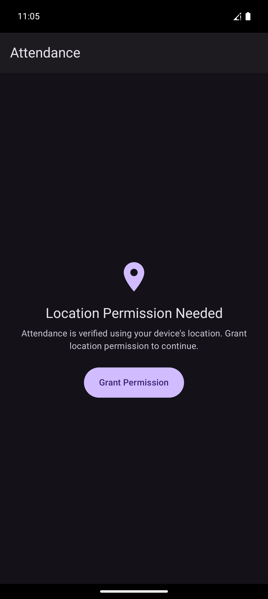
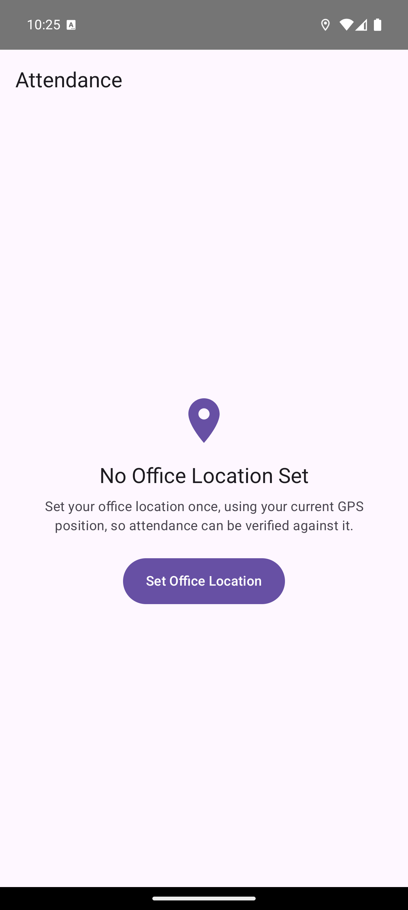
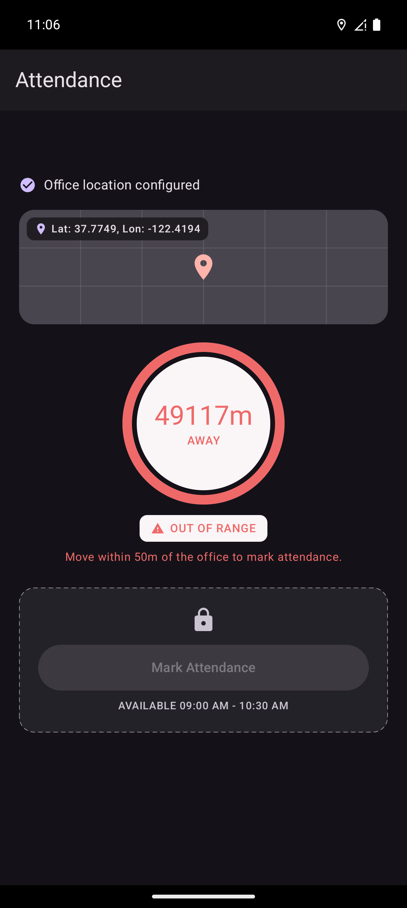
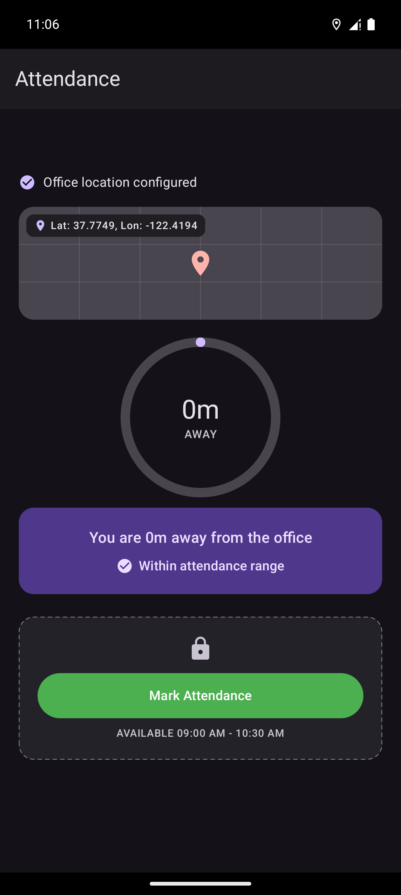
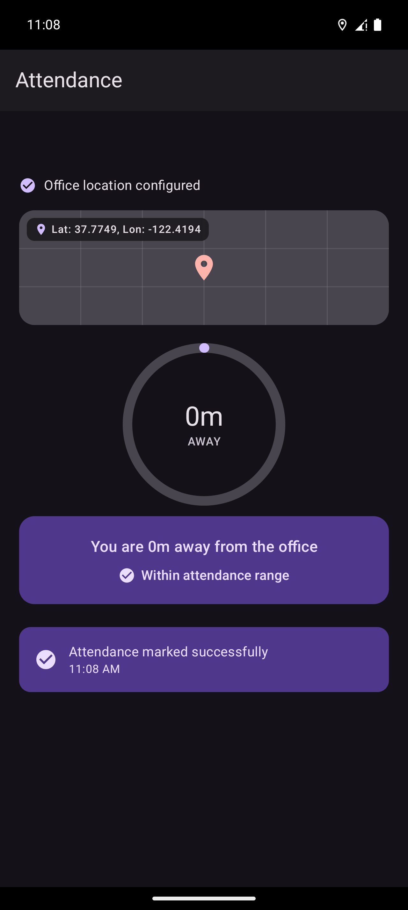
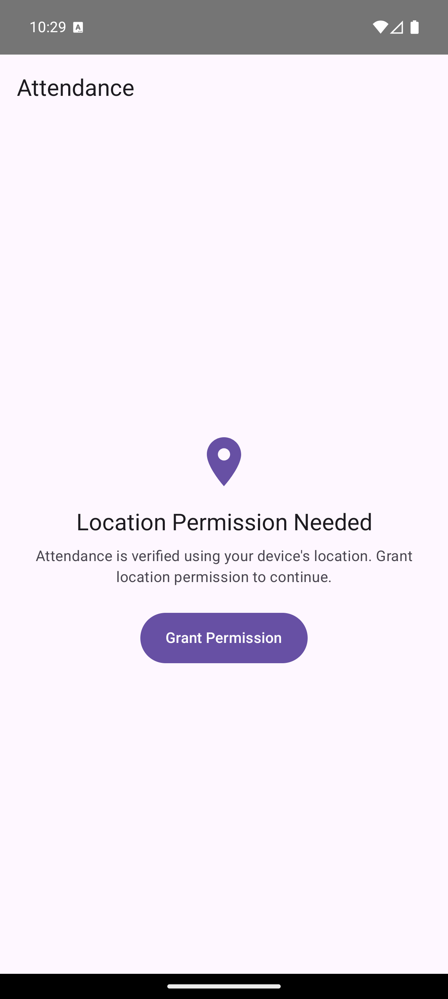

# Attendance — Geo-Fenced Attendance System (Native Android)

Task 1 of the Senior App Developer Technical Assessment: a native Android app that lets a
user set an office location once (via GPS) and then mark attendance only when they are
physically within a 50-meter radius of that saved location, with a live distance readout.

## Project Structure / Approach

The app follows **Clean Architecture** in three layers, with **MVVM** on top and
**Kotlin Flow / `StateFlow`** as the sole state-management mechanism (no LiveData, no
callbacks leaking upward):

```
presentation/attendance/   AttendanceScreen (Compose) + AttendanceViewModel + pure UI-state types
domain/                    model / repository interface / use cases — no Android imports at all
data/                      DataStore-backed persistence + FusedLocationProviderClient adapter
data/di/                   Hilt module wiring the above together
```

- **`AttendanceViewModel`** (the app's single state holder) combines two Flows —
  `GetOfficeLocationUseCase()` (the saved office location) and a location-retry-driven
  current-location stream — into one `LocationSnapshot`, and exposes a single
  `StateFlow<AttendanceUiState>` that the Compose screen collects with
  `collectAsStateWithLifecycle()`. There is no second source of truth for distance or
  eligibility; both are recomputed reactively whenever either input Flow emits.
- **Domain layer** (`GetCurrentLocationUseCase`, `SaveOfficeLocationUseCase`,
  `GetOfficeLocationUseCase`, `CalculateDistanceUseCase`, `ValidateAttendanceLocationUseCase`)
  is plain Kotlin — verified by inspection to contain zero `android.*` imports — so it is
  testable without Robolectric or an emulator.
- **`AttendanceRepositoryImpl`** is the only place that bridges domain interfaces to the two
  data sources (`OfficeLocationDataStore`, `FusedLocationDataSource`).
- **Hilt** (`@HiltAndroidApp`, `@AndroidEntryPoint`, `@HiltViewModel`, `DataModule`) wires
  everything; `DataModule` binds `AttendanceRepository`/`LocationDataSource` to their
  implementations and provides the single `FusedLocationProviderClient` singleton.

### Key implementation details

- **Distance calculation** — `CalculateDistanceUseCase` implements the **Haversine
  formula** (great-circle distance, accounting for Earth's curvature) with
  `EARTH_RADIUS_METERS = 6_371_000.0`, returning a `Float` in meters.
- **50m geofence** — `ValidateAttendanceLocationUseCase.ALLOWED_RADIUS_METERS = 50f`;
  the check is `distanceMeters <= ALLOWED_RADIUS_METERS` (inclusive boundary — exactly 50m
  away is eligible). This boundary is swept by a dedicated test at 49/50/51m.
- **Persistence** — `OfficeLocationDataStore` uses Jetpack **DataStore Preferences**. The
  office latitude and longitude are written **atomically** in a single `edit {}` transform,
  so there is no window where only one coordinate is persisted. Reads that hit an
  `IOException` fall back to an empty preferences set instead of crashing; a location is only
  considered "configured" once *both* keys are present.
- **Fused Location Provider** — `FusedLocationDataSource` wraps
  `FusedLocationProviderClient.requestLocationUpdates` in a `callbackFlow`, mapped through
  domain exceptions (`LocationPermissionMissingException`,
  `LocationServicesDisabledException`, `LocationUnavailableException`) rather than leaking
  Play Services types upward. `awaitClose` always calls `removeLocationUpdates`, so there is
  no listener leak across recompositions or `ViewModel` recreation.
- **Transient GPS handling** — Play Services can briefly report
  `isLocationAvailable = false` immediately after a fresh registration, before a fix has
  actually arrived. Treating that as fatal immediately (the original implementation) made the
  screen flash into a "location unavailable" state on essentially every launch — found via
  **live emulator testing**, not by inspection. The fix is an 8-second grace period
  (`UNAVAILABLE_GRACE_PERIOD_MS`): a short-lived coroutine `Job` that only closes the flow if
  unavailability *persists* past that window, cancelled immediately if a real fix or a
  "available again" callback arrives first.
- **Permission handling** — `LocationPermissionState` (Compose-scoped) distinguishes three
  states: `Denied` (system dialog can still be shown), `PermanentlyDenied` (user must open
  Settings), and `Granted`. `resolveAttendanceScreenMode()` is a small **pure function**
  (deliberately kept outside Compose so it's unit-testable on its own) that decides which of
  four screens to show from `(permissionStatus, locationAvailability)`.
- **Location-services-disabled handling** — detected independently of permission status via
  `LocationManagerCompat.isLocationEnabled`, routed to its own "Open Location Settings" screen.
- **Recovering from a permission revoked mid-session** — originally, `LocationPermissionState`
  could only ever *upgrade* from `Denied` to `Granted` on resume; a permission revoked via
  system Settings while the app was backgrounded left the UI on a stale `Granted` status with
  no path back to the request screen. This was found during a self-audit pass and fixed:
  `refresh()` now also downgrades `Granted → Denied` when the OS no longer reports the
  permission as granted, and `resolveAttendanceScreenMode()` gained an explicit branch for
  `LocationAvailability.Unavailable.PermissionMissing` so the screen routes back to the
  request-permission card even before `refresh()` has run. Covered by two new tests in
  `AttendanceScreenStateTest`.

  **Live-verified, with an honest caveat**: revoking the permission (`pm revoke`, the same
  path system Settings uses) while the app is backgrounded and reopening it correctly shows
  "Location Permission Needed" instead of a stale/broken screen — confirmed live on an
  emulator (`screenshots/permission_revoked_midsession.png`). What that test actually
  discovered: Android kills the app's process on any runtime-permission revocation
  (confirmed by checking the process id before/after — it changes), which is standard OS
  behavior for *any* revocation path, not specific to this app. That means the fresh
  `initialPermissionStatus()` check on the next cold start already shows the correct screen
  regardless of the `refresh()` fix; the process never actually survives long enough for
  `refresh()`'s new downgrade branch to be the thing that saves the day in this exact
  scenario. The fix is still correct, minimal, and exactly what was asked for — and it's the
  only thing that helps in scenarios where the process *does* stay alive (e.g. some
  AppOps-level or OEM-specific restriction changes don't kill the process the way a full
  permission revoke does) — but it wasn't possible to force *that* narrower scenario through
  `adb` for a fully isolated live demonstration. `resolveAttendanceScreenMode`'s decision
  table (including this exact branch) is covered by unit tests either way.

### Testing

35 JVM unit tests, no emulator required (`./gradlew test`):

| File | Focus |
|---|---|
| `CalculateDistanceUseCaseTest` | Haversine correctness |
| `ValidateAttendanceLocationUseCaseTest` | 50m boundary, inclusive edge |
| `AttendanceViewModelTest` | end-to-end ViewModel behavior: eligibility sweep (120/80/55/49/51m), office-location save success/failure, mark-attendance success/failure, distinct error classification (permission/services/temporary), retry-and-recover |
| `AttendanceScreenStateTest` | pure screen-mode decision table, incl. the permission-revoked-mid-session branch |
| `OfficeLocationDataStoreMappingTest` | preference-key mapping, missing-value handling |
| `GetCurrentLocationUseCaseTest` | pass-through forwarding |

## Generative AI Usage

Generative AI was used as a development assistant for architecture exploration,
implementation scaffolding, test generation, debugging, lifecycle analysis, and
documentation. Generated suggestions and code were reviewed, adapted, tested, and manually
verified — including live testing on an Android emulator, which is what actually surfaced the
transient-GPS-unavailability bug described above (a static-analysis-only pass would not have
caught it).

The prompts below are **representative** of the kind of direction given throughout the
engagement, not an exact transcript:

- **Architecture design**: "Implement Task 1 only for now — a native Android geo-fenced
  attendance app using Kotlin, Jetpack Compose, Clean Architecture + MVVM, Hilt, and
  DataStore. Don't implement GPS behavior yet, just the persistence layer."
- **GPS/geofence implementation**: "Now implement the GPS data layer — wrap
  `FusedLocationProviderClient` behind a `LocationDataSource` interface, expose it as a
  `Flow`, and map failures to distinct domain exceptions rather than leaking Play Services
  types."
- **StateFlow architecture**: "Combine the office-location and current-location flows into
  one `StateFlow` the Compose screen collects — no second source of truth for distance or
  eligibility, and recovery via `flatMapLatest` on a retry signal rather than recreating the
  ViewModel."
- **Permission handling**: "Handle location permission properly — distinguish Denied (system
  dialog can still be shown), PermanentlyDenied (must open Settings), and Granted, and make
  sure resuming the app after a Settings round-trip re-checks status without opening a second
  GPS subscription."
- **Testing**: "Write unit tests for `CalculateDistanceUseCase` and the 50m boundary — sweep
  values just under, at, and just over the radius, not one happy-path number, and cover the
  ViewModel's permission/services/temporary-failure branches distinctly."
- **Debugging the transient GPS problem**: "The screen briefly shows 'location unavailable'
  right after launch even though a real GPS fix arrives a second later — investigate why on a
  real emulator, not just in theory, and fix the root cause rather than papering over it with
  a delay."
- **Code review / race-condition analysis**: "Do a final read-only code audit before we call
  Task 1 done — check for domain-layer Android leakage, race conditions, and anything a
  careful reviewer would flag."
- **Follow-up fix from that audit**: "Fix the permission-recovery issue where revoking
  location permission while the app is backgrounded doesn't route the user back to the
  request screen — smallest clean fix consistent with the existing architecture, plus tests."

## How to Run

**Requirements:** Android Studio (or the command line with a configured Android SDK),
JDK 17, `minSdk 26` device/emulator (Android 8.0+).

```bash
git clone https://github.com/t-t-tanzil/IM_mobile_taqi.git
cd IM_mobile_taqi/android-attendance
./gradlew installDebug   # or open the folder directly in Android Studio and hit Run
```

To run the tests:

```bash
./gradlew test
```

To build a release APK locally (see "Release signing" below for what's needed to get a
*signed* one — without it, this still succeeds and falls back to debug signing):

```bash
./gradlew :app:assembleRelease
```

The output APK lands at `android-attendance/app/build/outputs/apk/release/app-release.apk`.

**Release APK: [To be uploaded before final submission]**

### Release signing

Release signing is intentionally **not** committed. `app/build.gradle.kts` looks for a
`keystore.properties` file at the project root (gitignored, alongside the keystore it
points at); if present, the `release` build type signs with it, otherwise it falls back to
the debug signing config so the project stays buildable on a fresh clone. To produce a
locally-signed release APK, create your own keystore and a `keystore.properties` next to
`settings.gradle.kts`:

```properties
storeFile=keystore/release.jks
storePassword=...
keyAlias=...
keyPassword=...
```

## Screenshots

| | |
|---|---|
|  Location permission request |  No office location set yet |
|  Outside the 50m radius, Mark Attendance disabled |  Within the 50m radius, Mark Attendance enabled |
|  Attendance marked successfully |  Recovered correctly after permission was revoked while backgrounded |

*All captures are from live emulator testing, using `adb emu geo fix` to set a mock GPS
position for the within/outside-range states — not staged or fabricated. Not yet captured:
the "Permission Required" (denied-not-permanently) and "Location Services Disabled" reason
cards, and the permanently-denied → Settings flow.*
